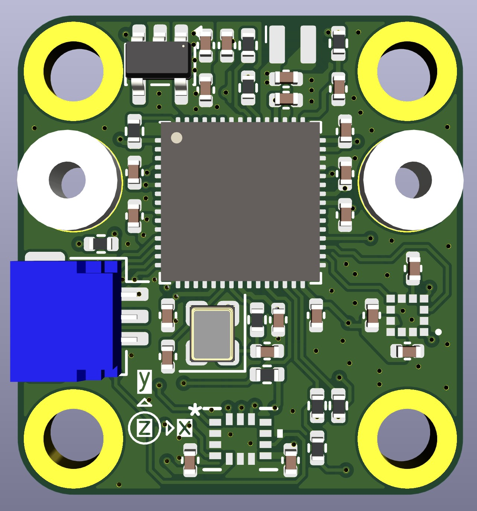
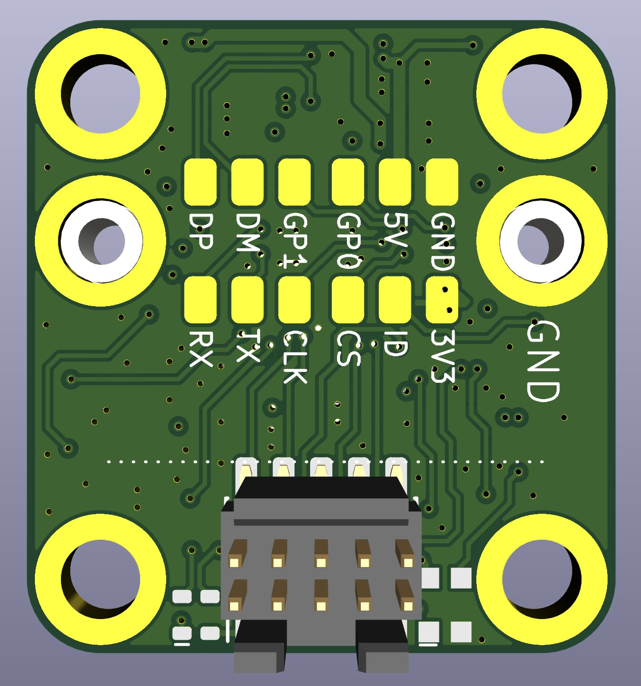
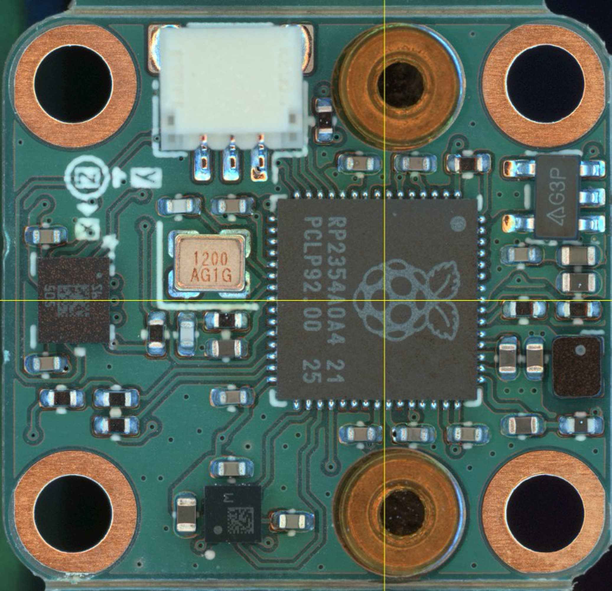
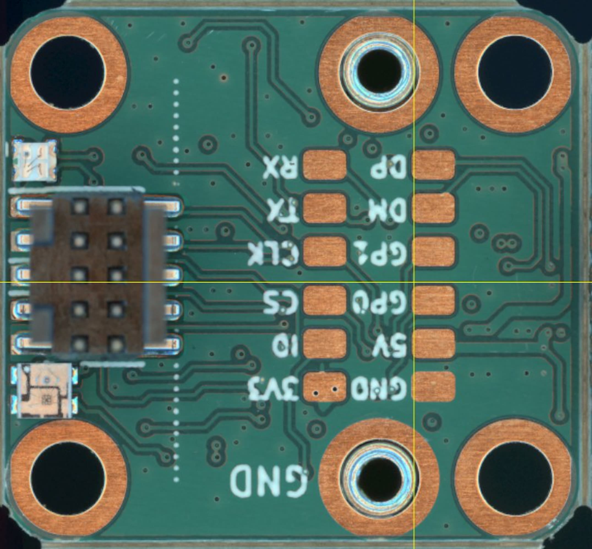
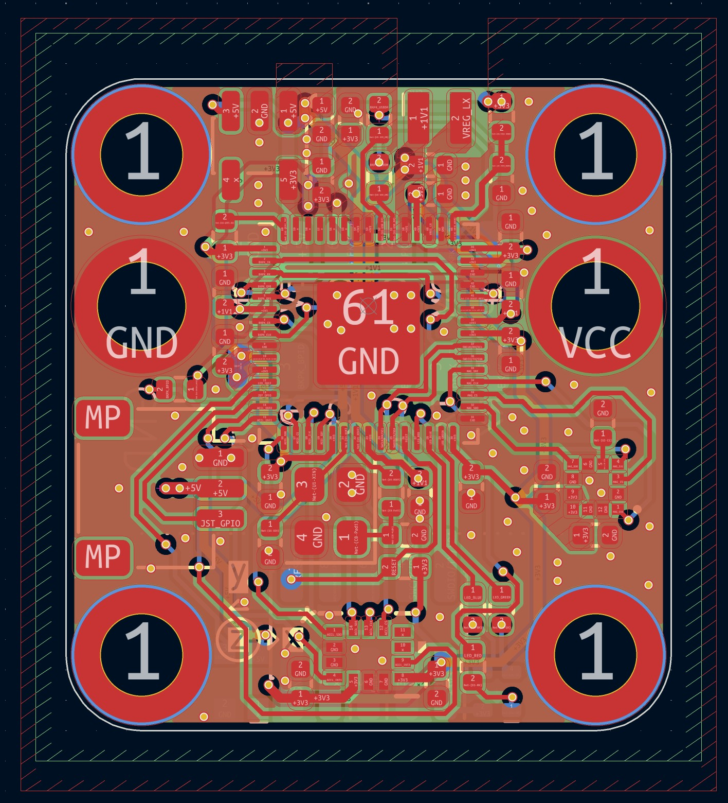
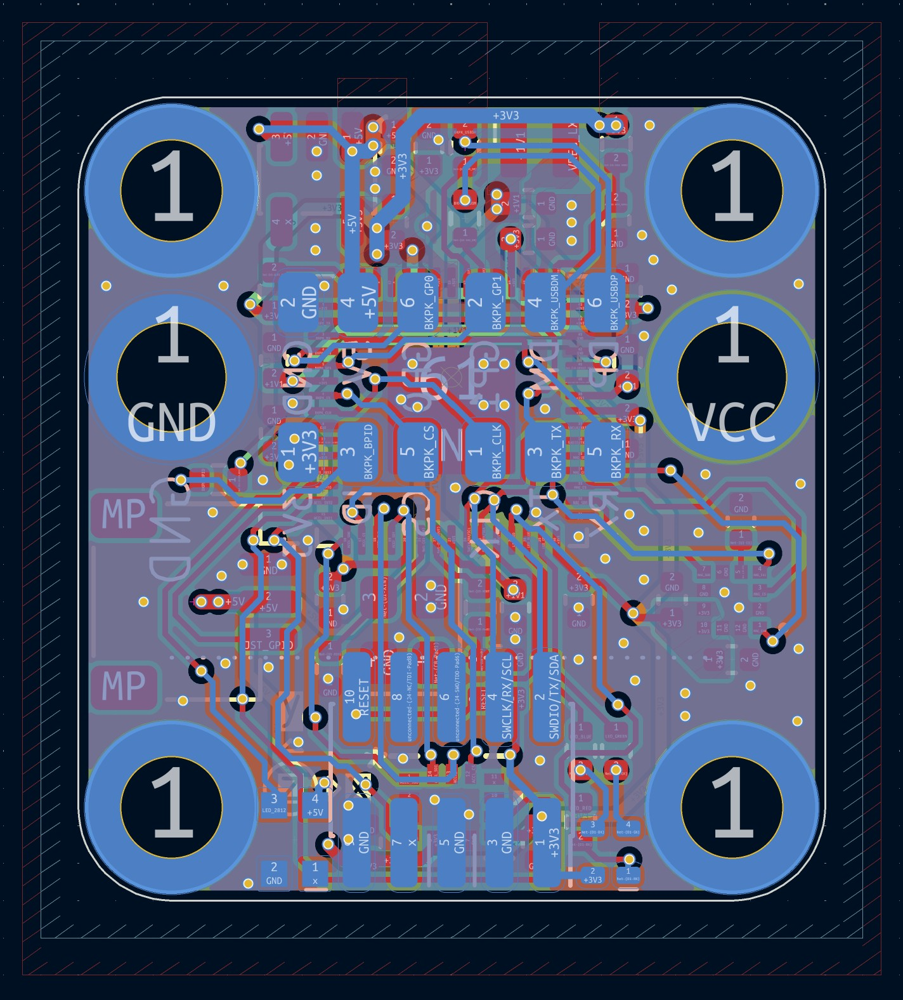
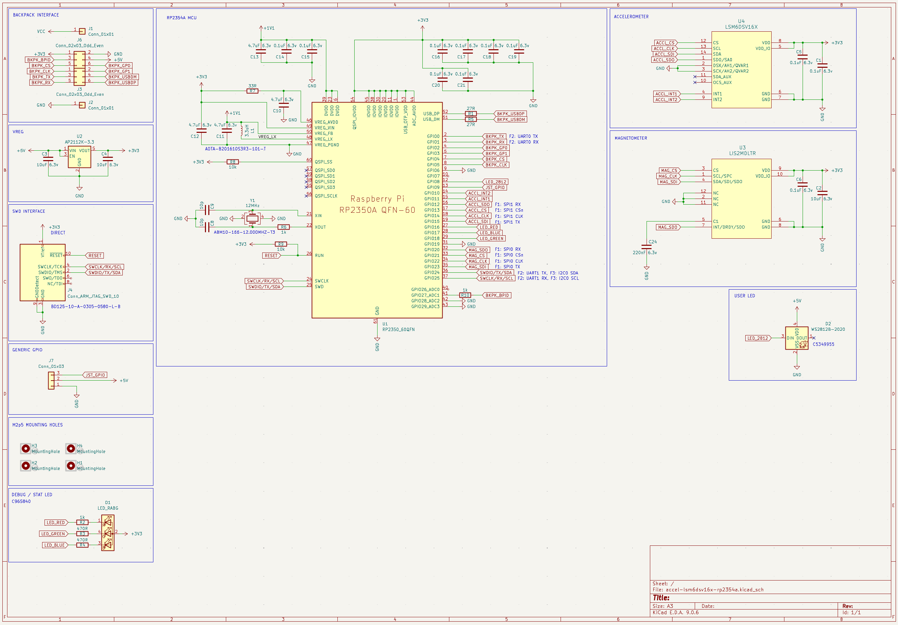
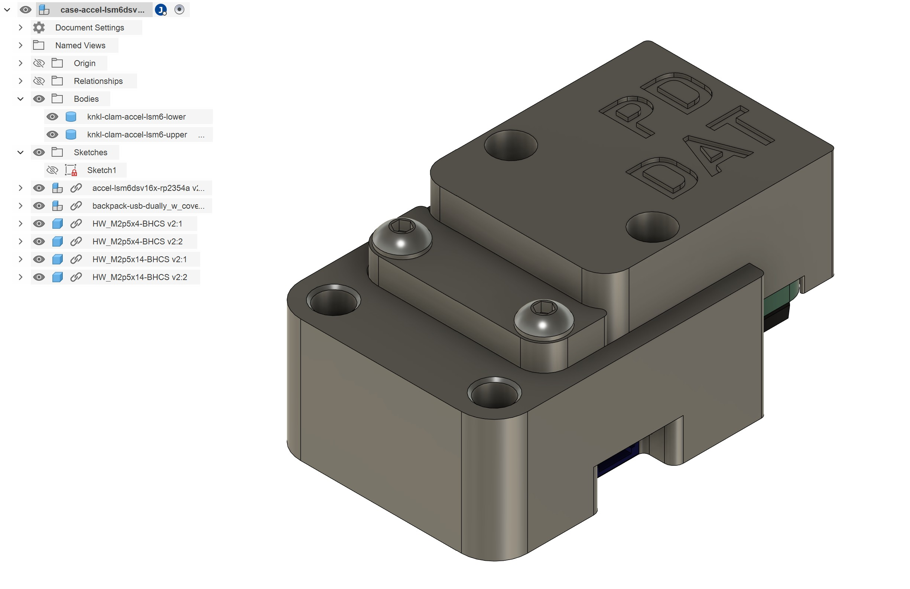

# Knuckles Accelerometer Module

> An IMU using the LSM6DSV16X accelerometer, LIS2MDL magnetometer, and RP2354A microcontroller. 

| | |
| --- | --- |
|  |  |
|  |  |
|  |  |

  

## Functional Description

This is an IMU module that pairs the LSM6DSV16X accelerometer with an LIS2MDL magnetometer, using an RP2354A microcontroller. It is part of a larger family of modular circuits that I call `knuckles` and are used to build machine controllers. The `knuckles` system is not yet public. This IMU will be used to improve kinematic and frequency response models with higher frequency data than I can currently capture. 

The RP2354A is connected to the LSM6 and LIS2 via two indepentent SPI busses, and the LSM6's two interrupt lines are also routed back to the RP2354A. The board also includes an RGB LED (using GPIOs) for RTOS status indication, and a WS2812-based RGB LED for application status. 

The board is programmed with a standard 10-pin SWD connector. Communication is done through a `backpack` connection, which interfaces to modular PHY circuits; this is part of the `knuckles` system: the interface can be extended for UART, USB, CAN, Ethernet, or Wireless links. 

I have also included a generic GPIO output on a JST-SH connector for adhoc applications (it may be useful and there was space). 

## Enclosure

The board can be mounted directly into a machine and enclosed there, or mounted into this enclosure and attached externally anywhere. This is intended to be printed in PETG and uses M2.5 hardware. 

## TODO

- bring up and test firmware